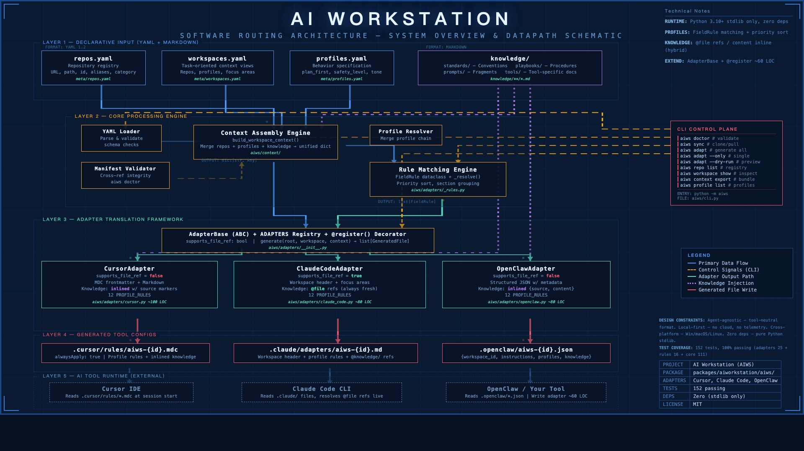

<p align="center">
  <strong>aips-personal</strong><br>
  <em>The Agent-Agnostic Control Plane for Multi-Repo AI Development</em>
</p>

<p align="center">
  <em>One source of truth. Every AI tool in sync. Always.</em>
</p>

<p align="center">
  
</p>

<p align="center">
  <a href="#the-problem">The Problem</a> &middot;
  <a href="#how-it-works">How It Works</a> &middot;
  <a href="#quick-start">Quick Start</a> &middot;
  <a href="#architecture">Architecture</a> &middot;
  <a href="#adapters">Adapters</a> &middot;
  <a href="#contributing">Contributing</a>
</p>

---

**aips-personal** is an open-source, local-first, and tool-agnostic control plane for cross-repository AI workflows. 

### ✨ Core Capabilities
By establishing a unified **knowledge layer and semantic model**, aips-personal breaks down the silos between heterogeneous AI tools (like Cursor, Claude Code, Windsurf, OpenClaw). Developers only need to define engineering standards, AI skills, and context memory **once**. The lightweight translation adapter system then automatically synchronizes these rules across all AI tools natively. This enables true **knowledge sharing and rule consistency** across multiple repos and tools.

### 🌍 Why We Open Sourced It
In an era of exploding but fragmented AI coding tools, we open-source this "AI workflow control plane" to define a standard protocol for AI-assisted development. We want to free teams from vendor lock-in and single-repo constraints, pushing the community toward a more efficient, AI-native collaborative development era.

> *It is **not** a monorepo. Sub-repositories stay normal Git repos on disk. This project is the **control plane and knowledge layer** above them.*

1. **The single-repo blind spot.** Every major AI coding tool — Cursor, Claude Code, Copilot — operates within the boundaries of one repository. Real engineering work spans many. aips-personal gives your AI tools a unified view across all of them.

2. **The tool fragmentation tax.** Teams using multiple AI tools pay a hidden cost: duplicating rules into `.cursorrules`, `CLAUDE.md`, and vendor-specific configs — then watching them drift apart. aips-personal eliminates this by maintaining one canonical source of truth, automatically translated into every tool's native format.

**Write shared meaning once. Adapt it many times.**

This is **not** a monorepo. Your repositories stay exactly where they are — normal Git repos on disk. aips-personal is the intelligence layer above them: a centralized metadata registry, a declarative knowledge base, and a lightweight adapter framework that projects your engineering standards, context, and conventions into any AI platform you use.

## The Problem

You maintain 5 repositories. You use Cursor and Claude Code. You've written coding standards, architectural decisions, and project conventions that your AI tools need to understand.

Today, you copy-paste those rules into 10 different config files (5 repos × 2 tools). When a convention changes, you update one file and forget the other nine. Your AI tools give inconsistent suggestions. Your team wastes time debugging AI behavior instead of shipping code.

**aips-personal reduces 10 config files to 1 source of truth — and keeps all of them in sync automatically.**

## How It Works

```
                          ┌─ CursorAdapter ──→ .cursor/rules/aiws-dev.mdc
profiles.yaml ────┐      │
workspaces.yaml ──┼──→───┼─ ClaudeCodeAdapter ──→ .claude/adapters/aiws-dev.md
knowledge/ ───────┘      │
                          └─ OpenClawAdapter ──→ .openclaw/aiws-dev.json
```

| Tool | Generated Format | Knowledge Strategy |
|------|------------------|--------------------|
| **Cursor** | `.cursor/rules/aiws-{id}.mdc` | Content inlined |
| **Claude Code** | `.claude/adapters/aiws-{id}.md` | `@file` references |
| **OpenClaw** | `.openclaw/aiws-{id}.json` | Content inlined |

One `aiws adapt` command generates all of them. Add a new tool? Write a 60-line adapter. Done.

## Use Cases

**Personal multi-repo development** — You maintain several projects, side experiments, and note repositories. aips-personal gives you one unified context view and generates consistent AI tool configs across all of them.

**Team repo as one of many** — Your team has its own collaboration platform (a monorepo, a shared workspace, etc.). From your personal workstation, that team repo is simply one of the repositories you work with daily. Register it alongside your other repos and build workspaces that span both personal and team contexts:

```yaml
# meta/repos.yaml
repos:
  - url: git@test.local:org/team-platform.git
    category: team
    description: Team collaboration platform
  - url: git@test.local:you/side-project.git
    category: personal
  - url: git@test.local:you/research-notes.git
    category: research
```

**Cross-project knowledge sharing** — Engineering standards, playbooks, and conventions defined once in `knowledge/` are shared across all workspaces and all AI tools. Update once, every tool sees the change — zero manual sync.

## Quick Start

```bash
# Clone
git clone https://github.com/superaistation/aips-personal.git
cd aips-personal

# Install
python -m venv .venv && source .venv/bin/activate
pip install -e "./packages/aips-personal[dev]"

# Validate manifests
aiws doctor

# Sync registered repositories
aiws sync

# Generate tool configs for a workspace
aiws adapt dev --dry-run          # Preview
aiws adapt dev                    # Write files
aiws adapt dev --only cursor      # Cursor only
aiws adapt --all                  # All workspaces
```

> **Tip:** If `aiws` is not on `PATH`, use `python -m aiws` instead.

> **Proxy:** `git clone` and `git pull` inherit environment variables. Set `HTTP_PROXY` / `HTTPS_PROXY` in your shell, or create a root `.env` file (loaded at startup without overriding existing variables).

## Architecture

System overview (declarative manifests → core engine → adapters → generated tool configs):

<p align="center">
  
</p>

On-disk layout:

```
aips-personal/
├── meta/                    # Registry — what exists
│   ├── repos.yaml           #   Repository registry (URL, path, id, aliases)
│   ├── workspaces.yaml      #   Task-oriented views across repos
│   └── profiles.yaml        #   Shared AI behavior profiles
├── knowledge/               # Knowledge — canonical guidance
│   ├── standards/           #   Engineering conventions
│   ├── playbooks/           #   Reusable procedures
│   ├── prompts/             #   Context fragments
│   └── tools/               #   Tool-specific docs
├── features/                # Features — umbrella-level specs
├── packages/aips-personal/  # Core — Python package
│   └── aiws/
│       ├── adapters/        #   Tool adapters (Cursor, Claude Code, OpenClaw)
│       ├── context/         #   Context assembly engine
│       └── ...              #   CLI, sync, validation, profiles, repos
├── repos/                   # Working copies (gitignored)
└── docs/                    # Documentation
```

### Design Principles

| Principle | What it means |
|-----------|--------------|
| **Agent-agnostic** | Rules, context, and skills are defined once in a tool-neutral format — never rewritten per vendor |
| **Local-first** | Everything runs on your machine. No cloud service, no telemetry, no lock-in |
| **Zero external deps** | The adapter system is pure Python stdlib. No Jinja2, no templating engines, no build step |
| **Cross-platform** | Core workflow runs on Windows, macOS, and Linux |
| **Composable** | Repos, workspaces, profiles, and knowledge are orthogonal building blocks — mix and match freely |

### Core Concepts

**Repository Registry** (`meta/repos.yaml`) — The single source of truth for every managed repository: remote URL, local path, identity, aliases, and description.

**Workspace** — A task-oriented context view that spans multiple repositories. Not a folder — a *perspective*. Examples: "build feature X across 3 repos", "investigate memory design", "prepare release".

**Profile** (`meta/profiles.yaml`) — A shared, tool-neutral behavior specification. Defines planning strategy, safety level, test expectations, and output style. The adapter framework translates each profile into every tool's native configuration format.

**Knowledge** (`knowledge/`) — Canonical human-and-AI guidance: engineering standards, playbooks, prompt fragments. Write it once, every AI tool consumes it automatically.

## Adapters

The adapter framework is the core differentiator. It translates canonical workspace + profile + knowledge data into tool-specific configuration files via a **declarative rule-matching engine** — no templates, no external dependencies.

Each adapter declares its capabilities:

```python
class ClaudeCodeAdapter(AdapterBase):
    supports_file_ref = True    # Uses @file references — always fresh

class CursorAdapter(AdapterBase):
    supports_file_ref = False   # Inlines content into .mdc

class OpenClawAdapter(AdapterBase):
    supports_file_ref = False   # Inlines as structured JSON
```

Profile fields are translated via declarative rules:

```python
FieldRule("behavior.plan_first", True,
          "Always create a plan and get approval before making changes.")
FieldRule("behavior.safety_level", "conservative",
          "Take a conservative approach: prefer minimal, reversible changes.")
```

**Adding a new tool adapter takes ~60 lines:**

1. Subclass `AdapterBase`
2. Define profile translation rules
3. Register with `@register("tool_name")`

## CLI Reference

```
aiws [--root PATH] [--verbose]
├── doctor                                  # Validate manifests
├── sync [ID...] [--jobs N]                 # Clone / fast-forward repos
├── adapt WORKSPACE [--only ADAPTER] [--dry-run] [--all]
│                                           # Generate tool configs
├── repo list                               # List registered repos
├── workspace list | show ID                # Inspect workspaces
├── context export ID [--format json|md]    # Export context bundle
└── profile list                            # List profiles
```

## Project Status

| Component | Status |
|-----------|--------|
| Repository registry + sync | Stable |
| Workspace + profile manifests | Stable |
| Context export (JSON / Markdown) | Stable |
| Manifest validation (`doctor`) | Stable |
| **Adapter framework** | **Production-ready** — Cursor, Claude Code, OpenClaw |
| Declarative rule-matching engine | Production-ready |
| Test suite | 152 tests, 100% passing |

## What aips-personal Is Not

- **Not a monorepo tool.** Your repos stay independent. This is a control plane above them.
- **Not tied to any vendor.** Cursor, Claude Code, OpenClaw today. Your custom tool tomorrow.
- **Not a cloud service.** Everything runs locally. Your code and knowledge never leave your machine.
- **Not a Git submodule manager.** No nested repos, no subtrees, no submodule hell.

## Contributing

Contributions are welcome. Please open an issue to discuss your idea before submitting a PR.

```bash
# Run the test suite (from repository root)
python -m aiws doctor
python -m pytest packages/aips-personal/tests/ -v

# Add a new adapter
# 1. Create aiws/adapters/your_tool.py
# 2. Define PROFILE_RULES and implement generate()
# 3. Add tests in tests/test_adapters.py
# 4. Import in cli.py _cmd_adapt()
```

For architecture details see `docs/architecture.md`; for project conventions see `knowledge/standards/aips-personal-conventions.md`.

## Coming Soon

**aips-personal** is the first product in the AI Station family. Stay tuned for:

- **AI Teamstation** — Team-scale workspace orchestration with shared knowledge bases and role-based profiles
- **AI Corpstation** — Enterprise-grade governance, audit trails, and multi-tenant workspace management

## License

MIT
