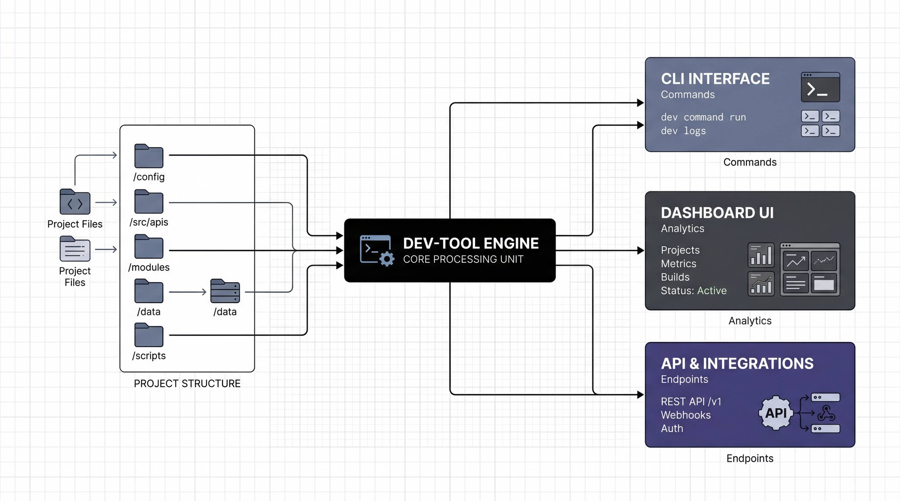

<p align="center">
  <strong>one-context</strong><br>
  <em>跨仓库 AI 协作与共享上下文层 · 智能体无关 · 本地优先</em>
</p>

<p align="center">
  <em>一处定义，处处同步，长期一致。</em>
</p>

<p align="center">
  
</p>

<p align="center">
  <a href="#vision">愿景与定位</a> &middot;
  <a href="#the-problem">痛点与挑战</a> &middot;
  <a href="#how-it-works">工作原理</a> &middot;
  <a href="#quick-start">快速开始</a> &middot;
  <a href="#architecture">架构</a> &middot;
  <a href="#adapters">适配器</a> &middot;
  <a href="#contributing">参与贡献</a>
</p>

---

<h2 id="vision">愿景与定位</h2>

AI 把个人写代码的速度拉满之后，瓶颈往往不在「某个人有多快」，而在 **上下文是否被切开**：人与人之间的交接（zip、即时通讯甩文件）、工具与工具之间的重复配置、以及微服务 / 多仓库下 **spec 与实现无法同屏**——SDD、伞形需求、跨服务改动，都容易卡在「仓库边界」上。

业界有一种回应是 **物理 monorepo**：把设计、原型、前后端、多服务、脚本、测试、spec 放进 **同一个 Git 树**，让 Git 成为协作协议。方向对，但 **迁移与组织成本** 让很多团队望而却步。

**one-context 走的是同一条问题意识，换一种代价结构：** 在 **umbrella 仓库** 里用 `meta/`、`knowledge/`、`features/` 与智能体模型，把 **共享上下文、规范、需求链与角色分工** 逻辑上收拢到一处；业务代码仍在各 **独立 Git 仓库**（`repos.yaml` 登记、`onecxt sync` 对齐本地工作副本）。你得到的是 **「多角色、多仓、多工具共用一个叙事」**，而不必把历史仓库物理合并。

**它不只是「控制平面」这一句话能概括的：** 适配器与 `onecxt adapt` 是 **落地手段**；更核心的是 **跨仓统一语义**（注册表 + 知识 + 伞形特性 + Agent 产物链）和 **可导出、可自动压缩的上下文**——在模型窗口有限的前提下，仍能把「与当前任务最相关」的事实送进 AI，而不是把整棵目录树原样塞进提示里。治理与校验（如 `onecxt doctor`）也可以集中在 umbrella 侧演进，而不必在每个业务仓重复铺一套流水线逻辑。

> **与物理 monorepo 的关系：** 同向（共享上下文、减少衔接摩擦），不同路（**逻辑聚合** 业务仓，**不**替代各仓自己的 Git 历史与发布节奏）。子仓库在磁盘上仍是普通 Git 仓库；本项目是叠在上面的 **智能层与知识层**。

---

**one-context** 是一套开源、本地优先、与具体 AI 工具解耦的 **跨仓库 AI 协作层**：控制平面、知识层与特性链共同构成上述「共享上下文」，并通过 CLI 在本地运行。

### ✨ 核心能力

通过统一的 **知识层与语义模型**，one-context 打通 Cursor、Claude Code、Windsurf、OpenClaw 等不同 AI 工具之间的壁垒。工程规范、AI 技能与上下文记忆 **只需维护一份**；轻量适配器会把这些内容自动同步为各工具的原生配置，从而在多仓库、多工具之间实现真正的 **知识共享与规则一致**。

**上下文自动压缩** — 导出或装配工作区上下文时，可按 **token 预算** 与 **结构化优先级**（注册表与 workspace 绑定关系、当前特性链、`knowledge/` 命中、冗余段落折叠等）自动收紧体积：先保证「事实不断裂」，再裁掉重复说明与低优先级片段，让长链路、多仓库场景下仍能把一屏可用的上下文交给模型与 IDE。

### 🌍 为何开源

在 AI 编程工具爆发但彼此割裂的当下，我们开源这套 **跨仓库 AI 协作与上下文模型**，希望为 AI 辅助开发沉淀一套可协作的约定。让团队少受厂商绑定和「单仓视野」的限制，一起走向更高效、更 AI 原生的协作开发。

1. **单仓盲区。** Cursor、Claude Code、Copilot 等主要工具，大多以「一个仓库」为边界；真实工程往往横跨许多仓库。one-context 为 AI 工具提供跨仓库的统一视图。

2. **多工具碎片化成本。** 同时使用多种 AI 工具时，同一份规范要抄进 `.cursorrules`、`CLAUDE.md` 和各家配置里，还很容易漂移。one-context 用 **一份权威来源** 自动生成各工具格式，消除重复与不一致。

**共享语义写一次，多工具自动适配。**

你的业务仓库仍在原处、仍是普通 Git 仓库；one-context 在 umbrella 里提供 **集中式元数据注册表**、**声明式知识库**、**伞形特性与文档链**，以及 **轻量适配框架**，把工程规范、上下文与约定投影到你使用的任意 AI 平台。

<h2 id="the-problem">痛点与挑战</h2>

典型的多仓库 AI 协作里，常见三类问题：**工具配置分散**、**跨仓工作上下文不一致**，以及 **缺少可沉淀的标准与编排层**（规范散落在各厂商配置文件和聊天记录里，而不是一处可治理的来源）。下面三张图分别对应这三类痛点的应对方向。

**一次配置，多端共享** — 在 **one-context 仓库根目录**（`meta/`、`knowledge/`、`features/` 等控制平面内容都在这里，与各子业务仓库分离）声明一次事实：`repos.yaml` 登记跨仓克隆与路径，`workspaces.yaml` 定义任务视角，`profiles.yaml` 与 `agents.yaml` 描述行为规格与智能体。`onecxt adapt` 经声明式规则引擎，把同一套语义编译为 Cursor（`.mdc` 规则）、Claude Code（适配器 Markdown + `@file` 知识引用）、OpenClaw（JSON）等**原生格式**，一条命令生成 workspace 与全部 agent 配置，**多终端、多工具共用同一套事实来源**；配合 `onecxt sync` 对齐本地仓库、`onecxt context export` 导出 Markdown/JSON 上下文包，并可选 **自动压缩**（见上方「上下文自动压缩」）。新工具侧接入以约 60 行适配器扩展，无需复制粘贴多份约定。

<p align="center">
  
</p>

**知识工具，开箱即用** — 可复用语义放在工具中立的 `knowledge/`（`standards/`、`playbooks/`、`prompts/` 等），由 profile 的声明式字段规则翻译为各 AI 可读指令；每个智能体在 `agents.yaml` 中绑定 profile、knowledge 与 `owns`（负责维护的产物 glob），`adapt` 后为 pm、architect、dev、qa、sre、knowledge-keeper 等生成各端一致的角色配置，**知识库、CLI 工作流与技能约定**随工具配置一起落地，无需从零拼装。伞形需求与交付物落在 `features/`，模板与索引见 `features/README.md`、`INDEX.md`，并与 `repos.yaml` 的仓库 **id** 对齐，避免规范只存在于聊天记录或某一家工具的配置里。

<p align="center">
  
</p>

**项目进度，自动同步** — **当前能力**：以 `features/<category>/<feature-id>/` 下的 `spec.md` → `tech_design.md` → `test_report.md` / `mr_report.md` → `deliver.md` 沉淀阶段产物，`features/INDEX.md` 维护需求状态一览；各智能体对产物有明确所有权，需求—设计—开发—测试—交付在**同一套文档链**上推进，避免「信息割裂、进度失真」；`onecxt context export` 可拉整包上下文（**长文档链可经自动压缩**再交给模型或同事），作为站会、评审或周报素材。**规划**：与产品线中的 **one-team** 衔接（OKR、日报/周报自动化等），在控制平面之上再补「自动汇总与对外上报」；今日重点是**结构化事实链与可追溯文档**，而非内置定时推送。

<p align="center">
  
</p>

假设你维护 5 个仓库，同时使用 Cursor 与 Claude Code；你已经写好了编码规范、架构决策和项目约定，并希望 AI 工具都能理解。

今天，这些规则往往被复制进 10 个配置文件（5 个仓库 × 2 套工具）。约定一变，你改了一处，另外九处忘记同步，AI 给出的建议就不一致，团队把时间耗在「调试 AI 行为」而不是交付上。

**one-context 把多份配置收敛为 1 份事实来源，并自动保持各工具侧同步。**

<h2 id="how-it-works">工作原理</h2>

```
                          ┌─ CursorAdapter ──→ .cursor/rules/onecxt-dev.mdc
profiles.yaml ────┐      │                      .cursor/rules/agent-pm.mdc
workspaces.yaml ──┼──→───┼─ ClaudeCodeAdapter ──→ .claude/adapters/onecxt-dev.md
knowledge/ ───────┤      │                         .claude/agents/pm.md
agents.yaml ──────┘      └─ OpenClawAdapter ──→ .openclaw/onecxt-dev.json
                                                     .openclaw/agents/pm.json
```

| 工具 | Workspace 配置 | Agent 配置 | 知识策略 |
|------|---------------|-----------|----------|
| **Cursor** | `.cursor/rules/onecxt-{id}.mdc` | `.cursor/rules/agent-{id}.mdc` | 内容内联 |
| **Claude Code** | `.claude/adapters/onecxt-{id}.md` | `.claude/agents/{id}.md` | `@file` 引用 |
| **OpenClaw** | `.openclaw/onecxt-{id}.json` | `.openclaw/agents/{id}.json` | 内容内联 |

一条 `onecxt adapt` 即可生成上述全部（workspace + 所有 agent 配置）。要接新工具？写一个约 60 行的适配器即可。

## Agent Framework

智能体（Agent）是one-context的一等公民，每个智能体负责开发生命周期中的特定环节：

| 智能体 | 角色 | 产物所有权 |
|--------|------|-----------|
| **pm** | 需求管理 | `features/**/spec.md`, `features/INDEX.md` |
| **architect** | 技术设计 | `features/**/tech_design.md`, `docs/architecture.md` |
| **dev** | 功能实现 | `features/**/worktrees.yaml` |
| **qa** | 测试验收 | `features/**/test_report.md`, `features/**/mr_report.md` |
| **sre** | 发布部署 | `features/**/deliver.md` |
| **knowledge-keeper** | 知识维护 | `knowledge/standards/`, `knowledge/playbooks/` |

每个智能体定义：
- **profile** — 行为规格引用
- **knowledge** — 知识文件/目录引用
- **owns** — 负责创建/维护的产物（glob 模式）
- **instructions** — 工具无关的角色说明

详细规范见 `knowledge/standards/agent-framework.md`。

## 适用场景

**个人多仓库开发** — 你同时维护若干项目、实验仓和笔记仓。one-context 提供统一的上下文视图，并在所有仓库上生成一致的 AI 工具配置。

**团队仓库只是其中之一** — 团队有自己的协作载体（monorepo、共享工作区等）。在你本机上，那个团队仓库只是日常涉及的多个仓库之一。把它与个人、研究类仓库一起登记，即可构建跨个人与团队语境的 workspace：

```yaml
# meta/repos.yaml
repos:
  - url: git@test.local:org/team-platform.git
    category: team
    description: Team collaboration platform
  - url: git@test.local:you/side-project.git
    category: personal
  - url: git@test.local:you/research-notes.git
    category: research
```

**跨项目知识共享** — 在 `knowledge/` 中定义一次的工程标准、playbook 与约定，可共享给所有 workspace 与所有 AI 工具；改一次，处处生效，无需手工同步。

<h2 id="quick-start">快速开始</h2>

```bash
# 克隆
git clone https://github.com/harnessworld/one-context.git
cd one-context

# 安装
python -m venv .venv
# macOS/Linux:   source .venv/bin/activate
# Windows:       .venv\Scripts\activate
pip install -e "./packages/one-context[dev]"

# 校验清单
onecxt doctor

# 同步已登记的仓库
onecxt sync

# 为某个 workspace 生成工具配置
onecxt adapt dev --dry-run          # 仅预览
onecxt adapt dev                    # 写入文件
onecxt adapt dev --only cursor      # 仅 Cursor
onecxt adapt --all                  # 所有 workspace
```

> **提示：** 若命令行找不到 `onecxt`，可用 `python -m one_context` 代替。

> **代理：** `git clone` / `git pull` 会继承环境变量。可在 shell 中设置 `HTTP_PROXY` / `HTTPS_PROXY`，或在仓库根目录放置 `.env`（启动时加载，且不覆盖已有环境变量）。

<h2 id="architecture">架构</h2>

系统概览（声明式清单 → 核心引擎 → 适配器 → 生成的工具配置）：

<p align="center">
  
</p>

磁盘布局：

```
one-context/
├── meta/                    # 注册表 — 管理哪些实体
│   ├── repos.yaml           #   仓库登记（URL、路径、id、别名）
│   ├── workspaces.yaml      #   跨仓库的任务视角
│   ├── profiles.yaml        #   共享的 AI 行为配置
│   └── agents.yaml          #   智能体注册表（角色、知识、产物所有权）
├── knowledge/               # 知识 — 权威指引
│   ├── standards/           #   工程约定
│   ├── playbooks/           #   可复用流程
│   ├── prompts/             #   上下文片段
│   └── tools/               #   面向工具的说明（权威规则保持工具中立）
├── features/                # 特性 — 伞形规格
├── memory/                  # 记忆 — 运行时状态（本地，通常 gitignore）
├── packages/one-context/    # 核心 — Python 包 + CLI（`onecxt`）；详见 packages/one-context/README.md
│   └── one_context/
│       ├── adapters/        #   工具适配器（Cursor、Claude Code、OpenClaw）
│       ├── context/         #   上下文组装与导出（含自动压缩策略）
│       └── ...              #   CLI、同步、校验、profile、repos、agents 等
├── repos/                   # 工作副本（通常 gitignore）
└── docs/                    # 文档
```

**CLI 代码在哪？** 所有 `onecxt` / `one_context` 实现位于 `packages/one-context/`。安装、运行与常用命令见 [packages/one-context/README.md](packages/one-context/README.md)。贡献者依赖与流程见 [CONTRIBUTING.md](CONTRIBUTING.md)。

### 设计原则

| 原则 | 含义 |
|------|------|
| **智能体无关（Agent-agnostic）** | 规则、上下文与技能以与厂商无关的格式定义一次，无需按每家工具重写 |
| **本地优先（Local-first）** | 全部在本地运行：无云服务、无遥测、无绑定 |
| **零额外依赖** | 适配层为纯 Python 标准库，无 Jinja2、无模板引擎、无构建步骤 |
| **跨平台** | 核心工作流支持 Windows、macOS、Linux |
| **可组合** | 仓库、workspace、profile、知识正交组合，自由搭配 |

### 核心概念

**仓库注册表（Repository Registry）**（`meta/repos.yaml`）— 每个被管理仓库的单一事实来源：远程 URL、本地路径、身份、别名与描述。

**Workspace** — 跨多个仓库的任务导向上下文视图。不是文件夹，而是一种 **视角**。例如：「在 3 个仓库上实现某功能」「排查内存设计」「准备发布」。

**Profile**（`meta/profiles.yaml`）— 共享的、与工具无关的行为规格：规划策略、安全级别、测试期望、输出风格等。适配框架把 profile 翻译为各工具的原生配置格式。

**Knowledge**（`knowledge/`）— 面向人与 AI 的权威指引：工程标准、playbook、提示片段。写一次，各 AI 工具自动消费。

**Agent**（`meta/agents.yaml`）— 智能体是一等公民配置对象，定义角色、知识引用、产物所有权和行为规格。每个智能体负责特定的开发生命周期环节（需求、设计、开发、测试、发布、知识维护）。适配器自动为每个智能体生成工具原生配置文件。

<h2 id="adapters">适配器</h2>

适配框架是核心差异点：通过 **声明式规则匹配引擎**，把 workspace + profile + knowledge 的权威数据翻译为各工具的配置文件 —— 无模板引擎、无外部依赖。

各适配器声明自身能力：

```python
class ClaudeCodeAdapter(AdapterBase):
    supports_file_ref = True    # 使用 @file 引用 — 始终读最新

class CursorAdapter(AdapterBase):
    supports_file_ref = False   # 内容内联进 .mdc

class OpenClawAdapter(AdapterBase):
    supports_file_ref = False   # 以内联结构化 JSON 输出
```

Profile 字段通过声明式规则翻译：

```python
FieldRule("behavior.plan_first", True,
          "Always create a plan and get approval before making changes.")
FieldRule("behavior.safety_level", "conservative",
          "Take a conservative approach: prefer minimal, reversible changes.")
```

**新增一个工具适配器大约只需 ~60 行：**

1. 继承 `AdapterBase`
2. 定义 profile 翻译规则
3. 使用 `@register("tool_name")` 注册

## CLI 速查

```
onecxt [--root PATH] [--verbose]
├── doctor                                  # 校验清单（含 agents.yaml）
├── sync [ID...] [--jobs N]                 # 克隆 / 快进更新仓库
├── adapt WORKSPACE [--only ADAPTER] [--dry-run] [--all]
│                                           # 生成工具配置 + agent 配置
├── repo list                               # 列出已登记仓库
├── workspace list | show ID                # 查看 workspace
├── context export ID [--format json|md] [--compress] [--target-tokens N]  # 导出上下文包；可选自动压缩
├── profile list | show ID [--resolved]     # 列出/查看 profile
└── agent list | show ID                    # 列出/查看智能体
```

### Agent 子命令

```
onecxt agent list                           # 列出所有智能体
onecxt agent show pm                        # 查看 PM 智能体详情
```

## 项目状态

| 组件 | 状态 |
|------|------|
| 仓库注册表 + 同步 | 稳定 |
| Workspace + profile 清单 | 稳定 |
| 上下文导出（JSON / Markdown） | 稳定 |
| 上下文自动压缩（预算 / 优先级裁剪） | 稳定 |
| 清单校验（`doctor`） | 稳定 |
| **适配框架** | **可用于生产** — Cursor、Claude Code、OpenClaw |
| 声明式规则匹配引擎 | 可用于生产 |
| **Agent Framework** | **可用于生产** — 6 个标准智能体 + 适配器生成 |
| 测试套件 | 见 CI — `packages/one-context/tests/` 下 pytest |

## one-context 不是什么

- **不是 monorepo 工具。** 各仓库仍相互独立；umbrella 提供逻辑上的「全景」与治理，不替代把多仓物理合并成一棵目录树。
- **不只是「生成几份 AI 配置文件」。** 那是适配层；完整价值还包括跨仓注册表、`knowledge/` 与 `features/` 下的权威语义、智能体产物链与上下文导出。
- **不绑定某一厂商。** 今天是 Cursor、Claude Code、OpenClaw；明天可以是你的自研工具。
- **不是云服务。** 一切在本地运行，代码与知识不离开你的机器。
- **不是 Git submodule 管理器。** 不搞嵌套仓库、subtree 或 submodule 泥潭。

<h2 id="contributing">参与贡献</h2>

欢迎贡献。提交 PR 前请先开 issue 简要讨论想法。

```bash
# 运行测试（在仓库根目录）
python -m one_context doctor
cd packages/one-context && python -m pytest tests/ -v

# 新增适配器
# 1. 新建 one_context/adapters/your_tool.py
# 2. 定义 PROFILE_RULES 并实现 generate()
# 3. 在 tests/test_adapters.py 中补充测试
# 4. 在 cli.py 的 _cmd_adapt() 中 import
```

架构细节见 `docs/architecture.md`；项目约定见 `knowledge/standards/one-context-conventions.md`。

## 后续规划

**one-context** 是 harnessworld 产品线的第一款。后续方向包括：

- **one-team** — 团队知识技能管理、OKR 跟踪、日报/周报自动化
- **one-corp** — 公司级研发宪法、战略拆解、跨团队治理

## 商标声明

Cursor、Claude Code、GitHub Copilot、Windsurf、OpenClaw 等名称均为各自权利人的商标。one-context 与上述厂商无关联，亦不代表其背书。

## 许可证

本项目采用 [MIT License](LICENSE) 授权。
