# Diagram Demos — 绘图引擎示例集

每种引擎、每种图表类型各一个精美示例，可直接复制到支持 PlantUML / Mermaid / Graphviz 的平台使用。

---

## 一、PlantUML

### 1. 序列图 (Sequence)

> 场景：电商下单支付全链路

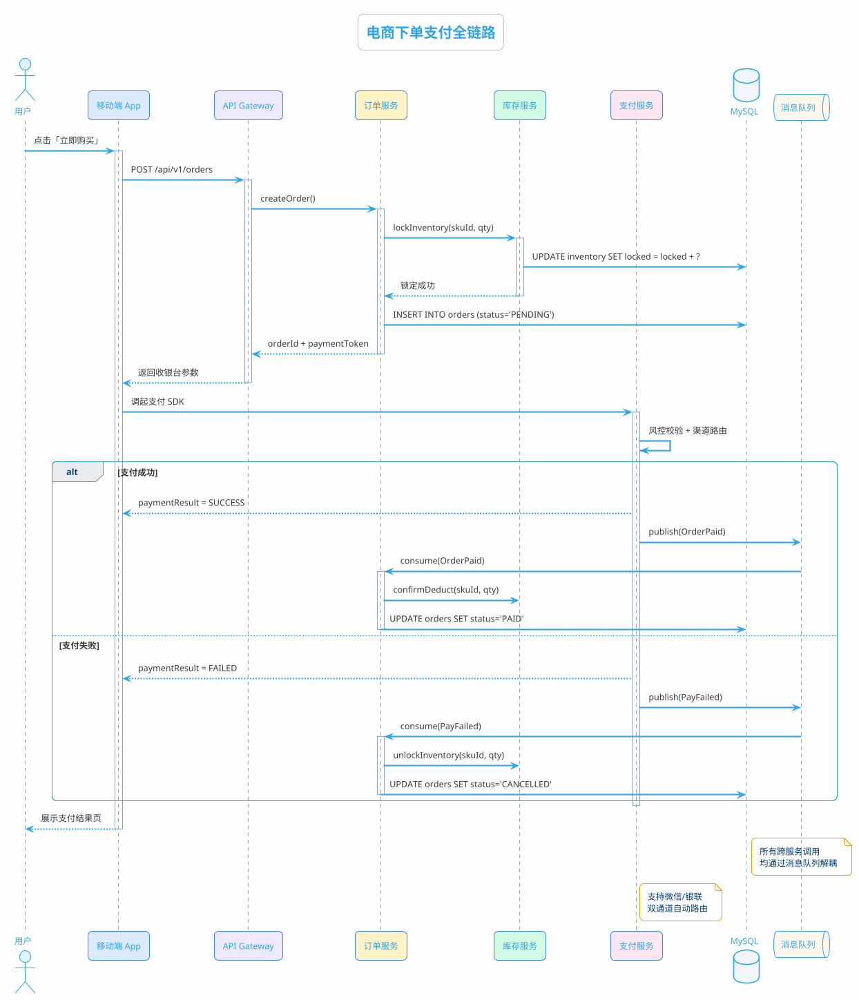

### 2. 时序图 (Timing)

> 场景：交通信号灯控制周期

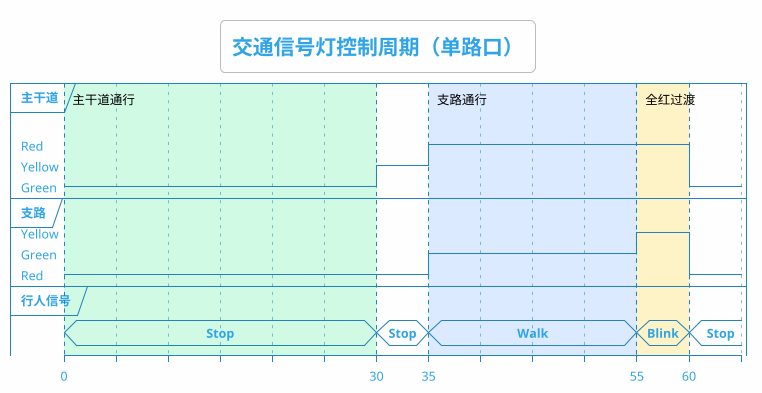

### 3. 用例图 (Use Case)

> 场景：在线教育平台核心功能

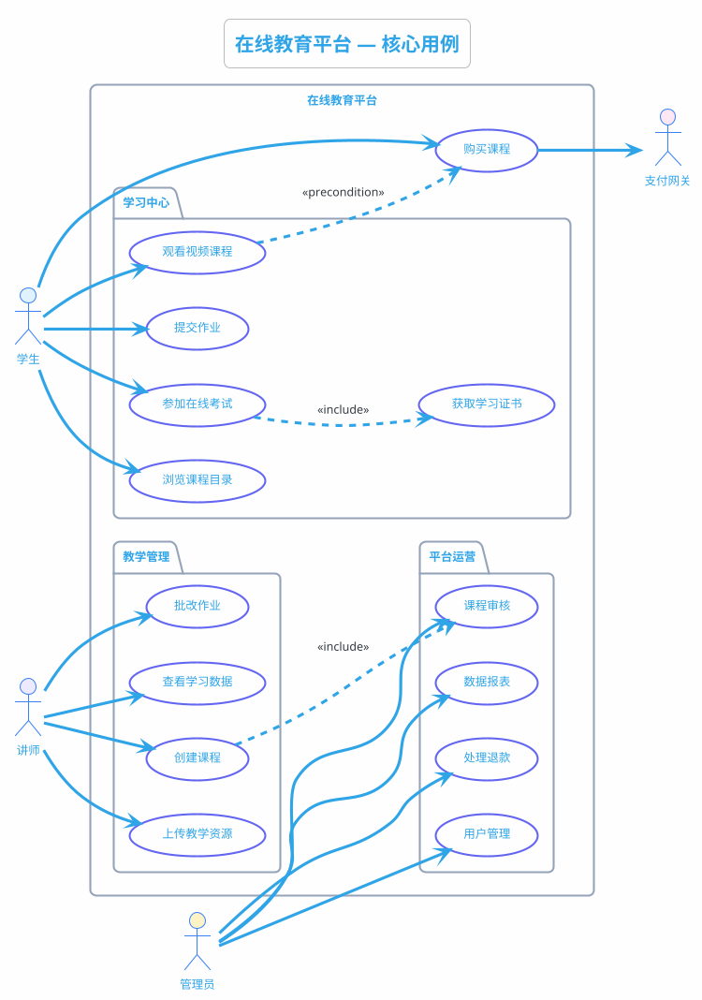

### 4. 类图 (Class)

> 场景：事件驱动架构的领域模型

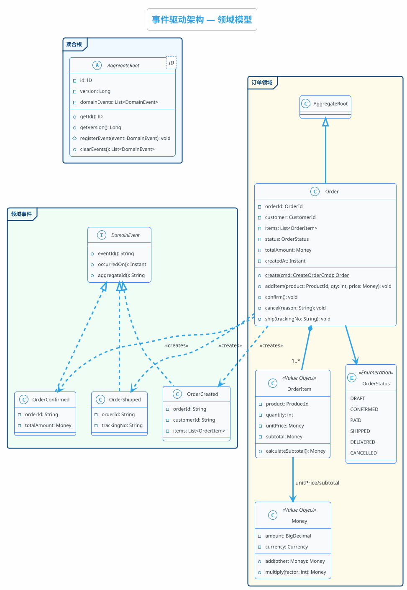

### 5. 活动图 (Activity)

> 场景：CI/CD 流水线（含并行）

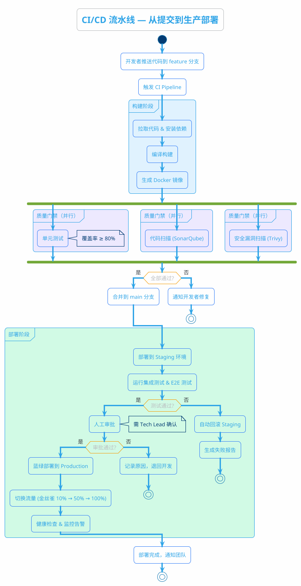

### 6. 组件图 (Component)

> 场景：数据分析平台架构（严格分层，自上而下）

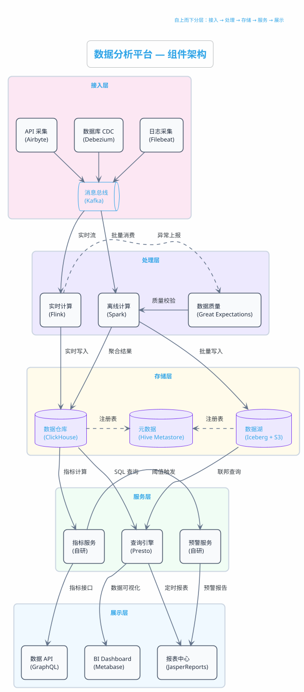

### 7. 状态图 (State)

> 场景：订单全生命周期

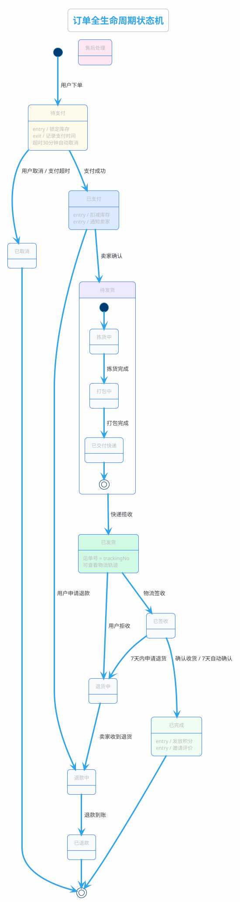

### 8. 对象图 (Object)

> 场景：运行时订单实例关系

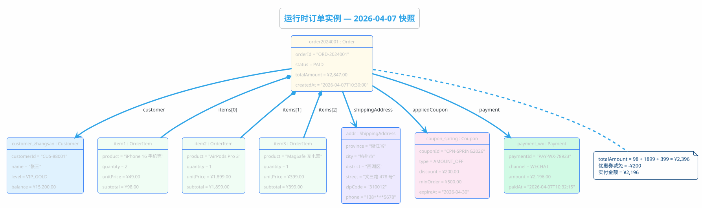

---

## 二、Mermaid

### 1. Flow Chart

> 场景：用户注册风控决策

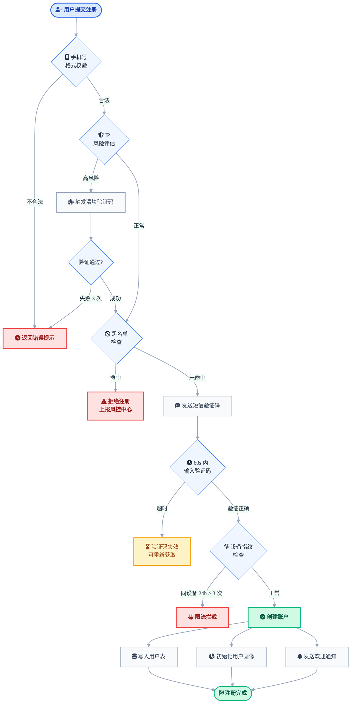

### 2. Sequence Diagram

> 场景：OAuth 2.0 授权码流程

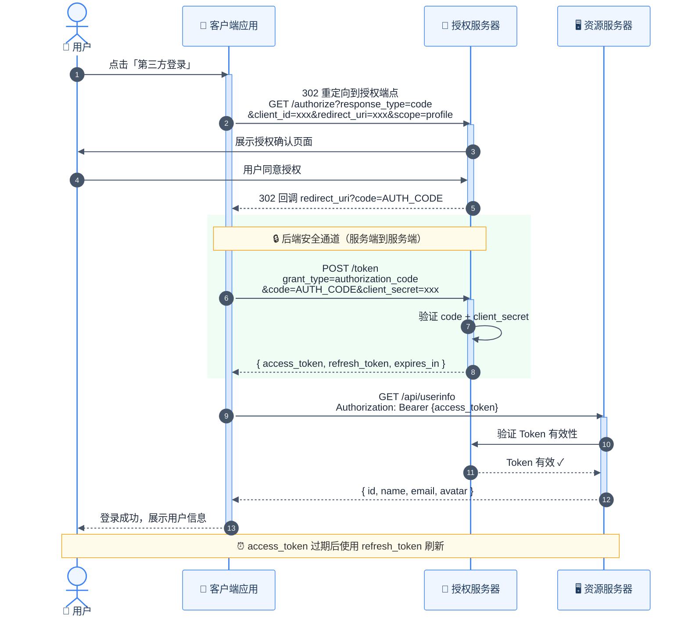

### 3. Class Diagram

> 场景：策略模式 — 多渠道消息推送

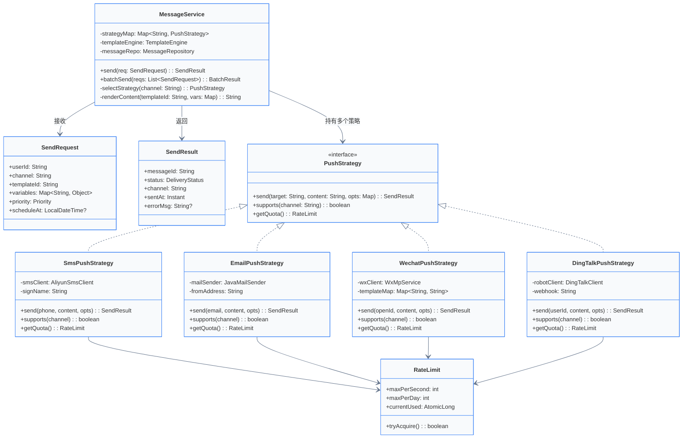

### 4. State Diagram

> 场景：Kubernetes Pod 生命周期

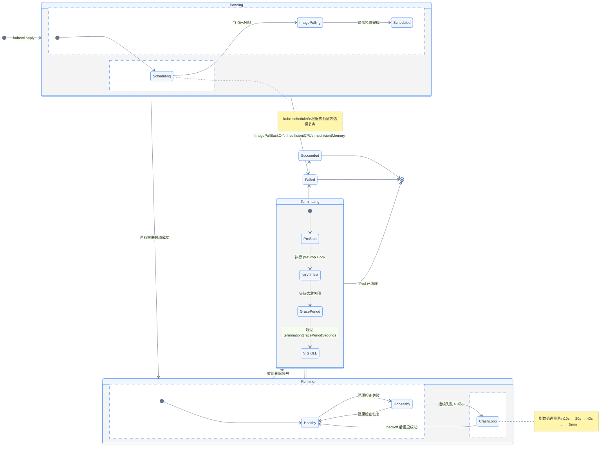

### 5. ER Diagram

> 场景：SaaS 多租户权限系统

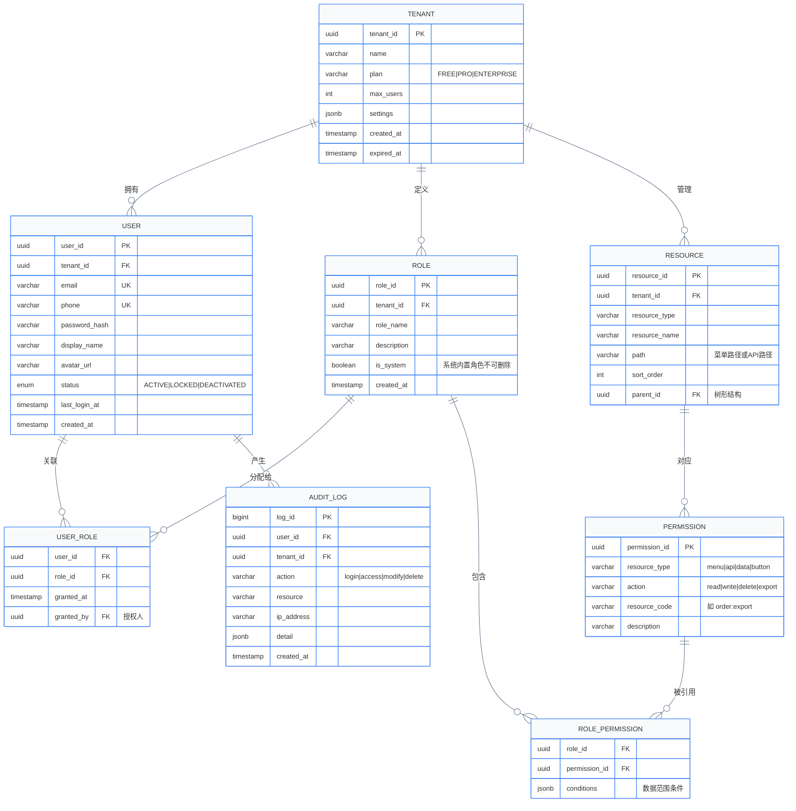

### 6. Gantt

> 场景：产品 v2.0 迭代排期

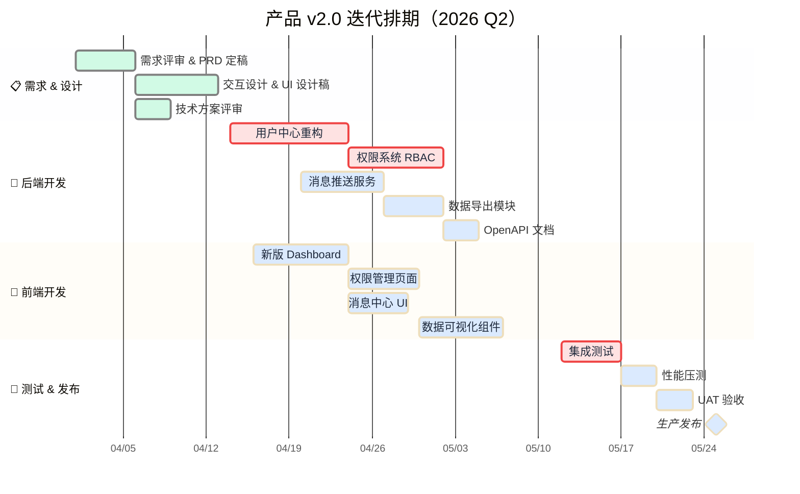

### 7. Pie Chart

> 场景：系统故障根因分布

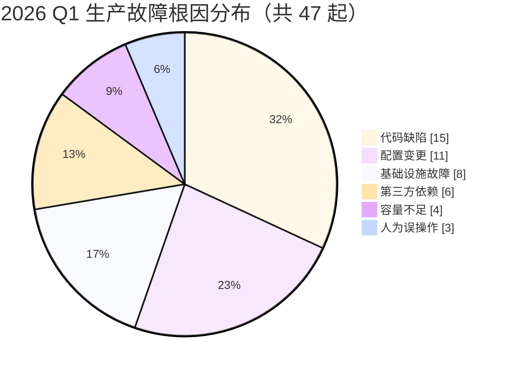

---

## 三、Graphviz

### Finite State Machine

> 场景：正则表达式 `(a|b)*abb` 的 DFA 识别器

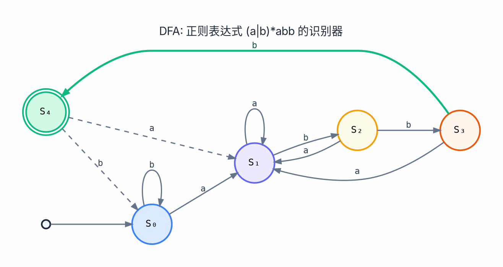
