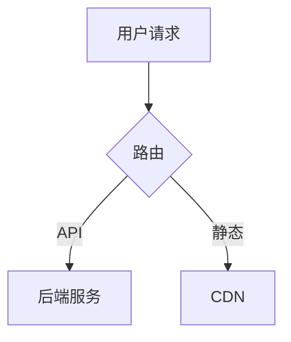

# Markdown 文档图表规范

> 来源：one-context 内部原创

文档中的图表有多种呈现方式，每种各有适用场景。本规范帮助作者选择最合适的形式。

核心原则：**"逻辑用代码，感官用截图"** — 易维护性（Markdown）与美观度/表现力（HTML 截图）之间的权衡。

## 图表决策模型

| 维度 | Markdown 绘图 (Mermaid/D2) | HTML / 专业工具截图 |
|------|---------------------------|-------------------|
| **修改频率** | **高** — 逻辑常变，随手改代码 | **低** — 改一次要重新截图/标注 |
| **视觉要求** | **中低** — 侧重逻辑清晰 | **极高** — 面向客户、品牌展示 |
| **搜索/SEO** | **支持** — 文本内容可被检索 | **不支持** — 除非手动加 Alt 信息 |
| **协作性** | **强** — Git 可对比差异 | **弱** — 二进制文件无法对比 |

## 三种图表形式

| 形式 | 定义 | 典型工具 |
|------|------|----------|
| **文本图表** | 用 Mermaid / D2 / PlantUML 等纯文本语法内嵌在 Markdown 中 | Mermaid, D2, PlantUML |
| **静态图片** | 预先渲染好的图片文件（SVG/PNG），通过 `` 或 `` 引用 | draw.io, Figma, Excalidraw, 截图 |
| **提示词生图** | 在文档中给出生图提示词，由读者自行用 AI 工具生成 | DALL-E, Midjourney, Claude artifacts |

## 细分场景选型

### (1) 适合 Markdown 文本图表的场景

核心特征：**逻辑正确 > 美观**，且处于迭代中，不值得花时间截图。

| 场景 | 推荐图表类型 | 推荐工具 | 说明 |
|------|------------|---------|------|
| 技术架构图（<15 节点） | 流程图 / C4 图 | **D2** / Mermaid | D2 默认样式更现代，布局算法更先进 |
| API/业务交互流程 | 时序图 | Mermaid | "丑"一点没关系，关键是逻辑 |
| 状态机 / 订单流 | 状态图 | Mermaid | 描述生命周期转换，如"待支付→已完成" |
| 项目甘特图 | 甘特图 | Mermaid | 方便每周调整日期，无需打开绘图软件 |
| 数据库模型 | ER 图 | Mermaid | 与代码同步演进，PR 可审阅 |
| 类/接口设计 | 类图 | Mermaid / PlantUML | 结构化、可 diff |
| 概念分类 / 知识体系 | 思维导图 | Mermaid | 简单层级结构 |
| 版本发布时间线 | 时间线 | Mermaid | 事件历史、里程碑 |
| 优先级分析 | 象限图 | Mermaid | 二维评估矩阵 |
| Git 分支策略 | Git 流程图 | Mermaid | 分支、合并可视化 |

### (2) 适合 HTML + 截图的场景

核心特征：当"Markdown 画出来的图不能忍"时。

| 场景 | 推荐工具 | 说明 |
|------|---------|------|
| 复杂分层架构（>3 层） | draw.io → SVG | Mermaid 自动布局会乱作一团 |
| 部署拓扑 / 网络架构 | draw.io → SVG | 需要精确分层布局 |
| UI 操作引导 | 浏览器截图 + 标注 | 涉及真实网页按钮、控制台界面 |
| 品牌宣传 / 战略分析 | HTML+CSS → 截图 | 漏斗图、圆环图等高阶概念模型 |
| 多维数据可视化 | ECharts / D3 → 截图 | 堆叠图、散点图、热力图 |
| 手绘风格草图 | Excalidraw | 头脑风暴、快速原型 |

### (3) 适合提示词生图的场景

核心特征：非精确信息，创意性强，不随代码变更。

| 场景 | 说明 |
|------|------|
| 概念示意 / 类比图 | 帮助理解抽象概念，如"微服务像城市交通" |
| 宣传配图 / 封面图 | 技术博客、演示文稿的装饰性插图 |
| 用户故事可视化 | 非精确的用户场景描绘 |

## 选型原则

### 优先文本图表（默认选择）

当图表满足以下全部条件时，使用 Mermaid/D2 文本图表：

1. **结构化**：节点和连线能用有向图/树/序列表达
2. **可枚举**：节点数 < 15，连线数 < 20
3. **需要版本管理**：图表随代码演进，需要在 PR 中 diff

### 降级为静态图片

当出现以下任一条件时，改用预渲染图片：

1. **布局敏感**：节点位置、对齐、分层有明确语义（如网络拓扑的层级）
2. **视觉信息**：颜色编码、截图、UI 样式是信息的核心部分
3. **复杂度溢出**：Mermaid 渲染后可读性差（节点重叠、连线交叉）
4. **非技术受众**：文档面向产品/业务人员，需要直观美观

### 使用提示词生图

当满足以下条件时，可在文档中提供生图提示词而非实际图片：

1. **非精确信息**：图的目的是帮助理解概念，而非传达精确结构
2. **创意性强**：类比、隐喻、宣传性质的配图
3. **时效性低**：不随代码变更而需要更新
4. **读者具备工具**：目标读者能方便地使用 AI 生图工具

## 文本图表工具选择

### Mermaid vs D2

| 维度 | Mermaid | D2 |
|------|---------|-----|
| **生态** | GitHub/GitLab 原生渲染，Obsidian/Notion 内置支持 | 需要独立渲染，但 VSCode 插件完善 |
| **默认样式** | 偏朴素，需手动调色 | 更现代硬朗，开箱即用 |
| **布局算法** | 基础，复杂图易交叉 | dagre/elk 引擎，自动排版不交叉 |
| **手绘风格** | 不支持 | 支持 Sketch 风格，白板感 |
| **图表种类** | 丰富（14+ 种：甘特、饼图、象限等） | 专注流程/架构图 |
| **推荐场景** | 内嵌文档、种类多样 | 核心架构说明、技术博客 |

**选择建议**：平台原生支持 Mermaid 时用 Mermaid；追求架构图颜值时用 D2。

### Mermaid 颜值提升技巧

在 Mermaid 代码开头加入主题配置，可以显著提升质感：

````markdown

````

技巧：使用 `base` 主题 + 手动指定品牌色，比默认的绿色/黄色好看很多。

## 按文档类型的配比建议

| 文档类型 | Markdown 占比 | 截图/图片占比 | 说明 |
|---------|:------------:|:-----------:|------|
| 内部开发手册 | **90%** | 10% | 不追求美观，追求"改起来快" |
| 产品对外文档 / 帮助中心 | 50% | **50%** | 美观度就是公信力 |
| 个人思考笔记 | **100%** | 0% | 把思考留给逻辑，不浪费在像素对齐上 |
| 技术博客 / 分享 | 70% | 30% | 核心架构用 D2，辅助说明用截图 |

## 格式规范

### 文本图表

````markdown

````

- 平台支持 Mermaid 时用 `mermaid`，追求颜值时考虑 `d2`
- 节点标签用中文，ID 用英文字母
- 每个图表上方加一行说明文字

### 静态图片

```markdown

```

- **优先 SVG**（可缩放、文件小），其次 PNG — 避免截图变成像素图
- 图片存放在就近的 `assets/` 目录
- 文件名用英文 kebab-case
- 源文件（.drawio / .fig）与导出图片放在同一目录，便于后续编辑
- 必须提供 alt 文本

### 提示词生图

```markdown
> **生图提示词**: 一幅等距视角的插画，展示微服务架构：
> 多个彩色容器排列在云平台上，容器之间用发光的数据流连接，
> 风格简洁现代，浅色背景，无文字。
```

- 用引用块 (`>`) 包裹提示词，加粗标注「生图提示词」
- 提示词应足够具体，不同人生成的结果应传达相同信息
- 在提示词前后用文字说明图的用途，不依赖图片本身传达关键信息

## 参考资料

- [Mermaid 官方语法参考](https://mermaid.js.org/intro/syntax-reference.html)
- [D2 官网](https://d2lang.com/)
- [C4 Model](https://c4model.com/) — 4 层架构可视化框架
- [14 种 UML 图表类型详解 - Creately](https://creately.com/blog/diagrams/uml-diagram-types-examples/)
- [Diagrams as Code - DEV](https://dev.to/cgarza/diagrams-as-code-just-make-sense-50on)
- [两种基本架构图类型 - Ilograph](https://www.ilograph.com/blog/posts/the-two-fundamental-types-of-architecture-diagrams/)
